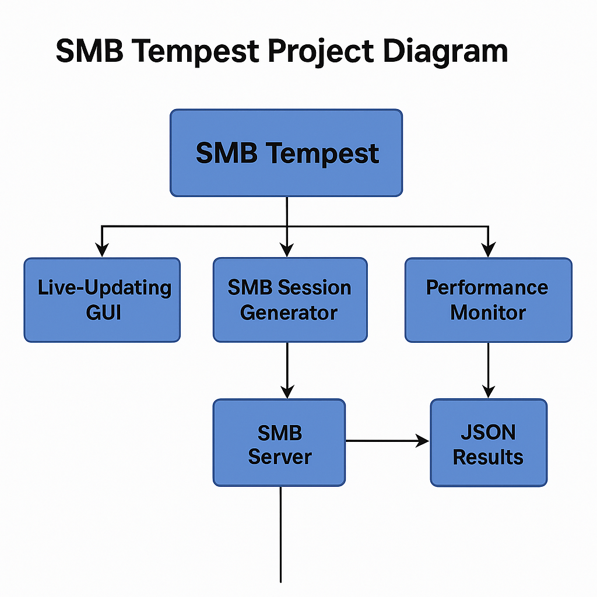

# SMB Tempest

Multi-threaded SMB Session Generator and Load Tester for Qumulo.

---

## Quick Start

```bash
bash setup_smb_tempest_env.sh
source smb_tempest_env/bin/activate
python smb_tempest.py --server_ip <IP> --share_name <share> --username <user> --password <pass>
```

---

## Overview

SMB Tempest is a Python-based tool designed to generate load against SMB shares by creating concurrent sessions, writing large files, reading them, and generating random file churn. It tracks throughput and performance metrics to assist in storage performance evaluation.



---

## Tools Included

| Tool                      | Purpose                                          |
|----------------------------|--------------------------------------------------|
| `smb_tempest.py`           | Multi-threaded SMB session load generator        |
| `smb_session_monitor.py`   | Real-time active/inactive SMB session tracker    |
| `setup_smb_tempest_env.sh` | Safe, interactive Python environment bootstrap  |

---

## Setup Environment

Use the included helper script for quick and safe environment setup:

```bash
bash setup_smb_tempest_env.sh
```

This script will:

- Verify Python 3.10+
- Create and configure `smb_tempest_env` virtual environment
- Install required modules (`smbprotocol`)
- Output a `requirements.txt`

To activate your environment after setup:

```bash
source smb_tempest_env/bin/activate
```

---

## Running SMB Tempest

Example command:

```bash
python smb_tempest.py --server_ip 10.1.62.40 --share_name tempest --username admin --password Admin123! --num_tasks 100 --max_file_size 128
```

Options:

- `--server_ip` (Required)
- `--share_name` (Required)
- `--username` (Required)
- `--password` (Required)
- `--num_tasks` (default: 1)
- `--max_file_size` (default: 1024 MiB)

---

## Companion Tool: `smb_session_monitor.py`

`smb_session_monitor.py` complements `smb_tempest.py` by monitoring SMB session states during and after tests.

Example usage:

```bash
python smb_session_monitor.py --ip 10.1.62.40 --username admin --password Admin123! --threshold 60 --interval 5
```

---

## Example Results

```plaintext
================== Test Summary ==================
Total Tasks Executed       : 100
Total Random Files Created : 6400
Total Bytes Read           : 12800000000 bytes (12207.03 MB)
Total Time Taken           : 25.82 seconds
Overall Throughput         : 472.69 MB/s
==================================================
```

---

## License

MIT License — See LICENSE file for details.

---

## Contact

Created by Kevin McDonald (KMac) & Sheila.
Questions or suggestions? Open an issue on GitHub.

---

**Disclaimer:** Ensure you have the proper permissions before running SMB load tests. Always follow organizational policies and security best practices.
