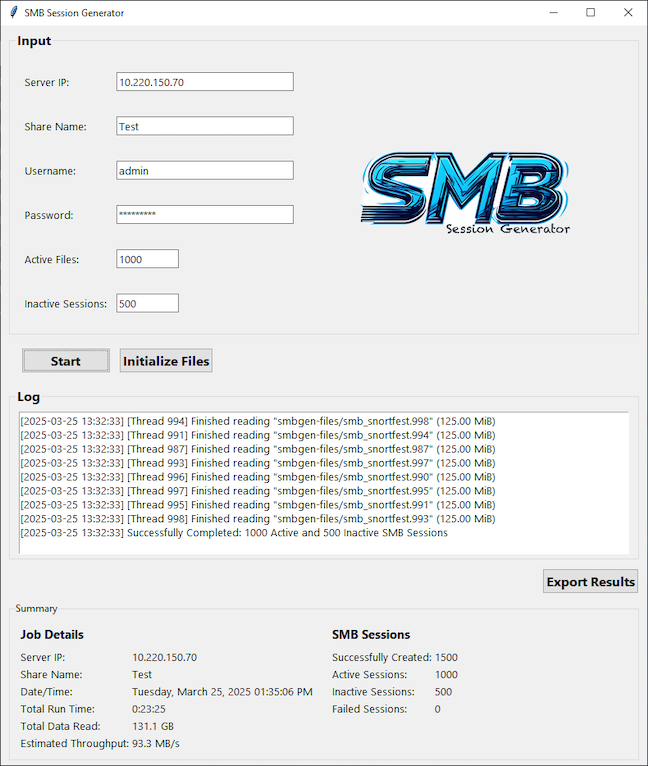

# SMB Session Generator (smbgen)

SMB Session Generator (smbgen) is a Python-based tool designed to create multiple concurrent SMB sessions to a specified share, perform parallel file reads, and aggregate performance metrics. It features a live-updating GUI that displays real-time summaries and logs, and supports exporting results as JSON.

|  | **Built specifically for Microsoft Windows**, it delivers an authentic native SMB experience. |
| --- | --- |
## Features

- **Concurrent SMB Sessions:** Establish multiple SMB sessions simultaneously.
- **Parallel File Reading:** Read files in parallel to simulate load.
- **Performance Metrics:** Track successful/failed sessions, total data read, throughput, and runtime.
- **Live GUI Summary:** Monitor job details and session metrics in real time.
- **Results Export:** Save aggregated results and logs to a JSON file.
- **File Initialization:** Automatically create test files (125 MiB each) on the target share.
- **OS Tuning Recommendations:** Provides tips for Windows Server 2019 to optimize outbound TCP connections.

## Requirements

- **Python:** 3.x
- **Python Modules:**
    - `argparse`
    - `concurrent.futures`
    - `datetime`
    - `json`
    - `logging`
    - `os`
    - `threading`
    - `time`
    - `uuid`
    - `humanize`
    - `asyncio`
    - `tkinter`
    - `Pillow` (PIL)
    - `colorama`
    - `smbprotocol`

## Installation

1.  **Clone the Repository:**

    ```bash
    git clone [https://github.com/KMacTN/smbgen.git](https://github.com/KMacTN/smbgen.git)
    cd smbgen
    ```

2.  **Set Up a Virtual Environment (Optional but Recommended):**

    ```bash
    python -m venv venv
    # On Windows:
    venv\Scripts\activate
    # On macOS/Linux:
    source venv/bin/activate
    ```

3.  **Install Dependencies:**

    `pip install -r requirements.txt`

    Otherwise, install the necessary modules individually:
    `pip install humanize Pillow colorama smbprotocol`

## Usage

### Running the Application

You can start the application via the command-line with various options:

```bash
python smb_session_generator.py --server_ip <SERVER_IP> --share_name <SHARE_NAME> --num_active_files <NUM_ACTIVE_FILES> --num_inactive_sessions <NUM_INACTIVE_SESSIONS> --username <USERNAME> --password <PASSWORD>
```

For example:

```bash
python smb_session_generator.py --server_ip 192.168.1.100 --share_name Test --num_active_files 10 --num_inactive_sessions 5 --username user --password pass
```

### GUI Operation

When run without or with partial command-line arguments, the application opens a GUI that allows you to:

-   **Input Connection Details:** Enter the Server IP, Share Name, Username, Password, number of Active Files, and Inactive Sessions.
-   **Start/Stop Operations:** Use the Start button to begin the session generation and file reading tasks. The button toggles to a Stop button to halt operations.
-   **Initialize Files:** Create test files on the target SMB share (each file is 125 MiB) using the “Initialize Files” button.
-   **Export Results:** Save the aggregated performance metrics and logs as a JSON file.



### OS Tuning Recommendations (Windows Server 2019)

For best performance with many concurrent outbound TCP connections, consider these tuning adjustments:

-   **Increase Ephemeral Port Range:**
    Set `MaxUserPort` (e.g., to 65534) in:
    `HKEY_LOCAL_MACHINE\SYSTEM\CurrentControlSet\Services\Tcpip\Parameters`
-   **Reduce TcpTimedWaitDelay:**
    Change this value to 30 seconds (default is often 240 seconds) in the same registry key.
-   **Adjust Desktop Heap Allocation:**
    If the GUI desktop heap becomes a bottleneck, increase its allocation in:
    `HKEY_LOCAL_MACHINE\SYSTEM\CurrentControlSet\Control\Session Manager\SubSystems\Windows`

### Debug Logging

Warning: The SMB protocol library can produce **extensive debug** output.  By default, the SMB logger is set to WARNING level to reduce noise.  To enable detailed debug logs, run the script with the `--debug` flag:

```bash
python smb_session_generator.py --debug [other options...]
```

## License

### MIT License - See LICENSE file for details.

## Contributing

Contributions, bug reports, and feature requests are welcome.  Please open an issue or submit a pull request on GitHub.

## Contact

Created by Kevin McDonald (KMac) & Sheila (Conglomeration of AI Assistants).
For questions or suggestions, please open an issue on GitHub.

---

**Disclaimer:** Ensure you have the proper permissions and network access before running SMB operations. Follow any prerequisite security guidelines (e.g., disabling local firewall or antivirus) as indicated by the application prompts.
